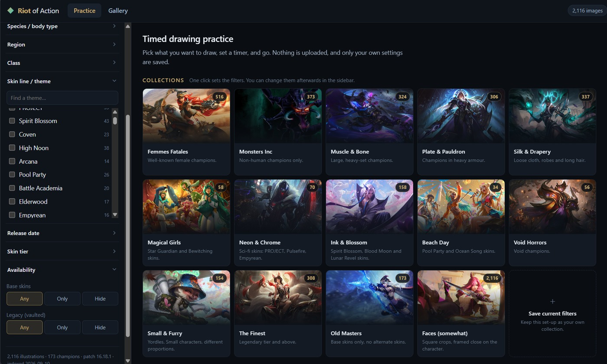

# Riot of Action

Timed drawing practice, like QuickPoses or Line of Action, but the reference
pool is Riot Games' League of Legends splash art: **2,116 illustrations across
173 champions**.

**[Try it here](https://riot-of-action.vercel.app)**

Pick what you want to draw, set a timer, and go. You can filter the pool by
gender, champion, species, region, class, skin line, release date or skin tier,
or start from one of fourteen ready-made collections. While drawing you get
mirror, greyscale, blur, a grid overlay and a dim toggle.

It is a static site. No build step, no dependencies, no server, no accounts,
and nothing leaves your browser.



---

## What it does

### Filters

Every filter combines with the others (AND across groups, OR within a group),
and each option shows how many illustrations it would leave you.

| Filter | Values |
| --- | --- |
| **Gender** | Male · Female · Other (dual beings and anything with no gendered presentation) |
| **Skin line / theme** | 225 lines, alphabetical, with 22 marquee themes pinned above |
| **Champion** | All 173, searchable, with portraits |
| **Species / body type** | Human, Yordle, Vastaya, Undead, Spirit, Beast, Construct, Celestial, Void, Darkin, Dragon, Demon, Elemental, Ascended, Demigod, Plant |
| **Region** | The 13 Runeterran regions, plus Camavor and unaffiliated |
| **Class** | Assassin · Fighter · Mage · Marksman · Support · Tank |
| **Release date** | "In the last 1 / 2 / 3 / 5 years", or pick individual years back to 2015 |
| **Skin tier** | Base · Standard · Rare · Epic · Legendary · Mythic · Ultimate · Transcendent · Exalted |
| **Availability** | Show / hide base skins; show / hide legacy (vaulted) skins |
| **Free text** | Matches champion, title, skin name and skin line |

Gender, species, region and release date are **not** in Riot's data. See
[Where the data comes from](#where-the-data-comes-from).

### Collections

Fourteen built-in one-click starting points, each of which just sets the filters so you
can loosen or extend them afterwards:

**Femmes Fatales** · **Monsters Inc** · **Muscle & Bone** · **Plate & Pauldron**
· **Silk & Drapery** · **Magical Girls** · **Neon & Chrome** · **Ink & Blossom**
· **Beach Day** · **Void Horrors** · **Small & Furry** · **The Finest**
· **Old Masters** · **Faces (somewhat)**

They live in [`js/presets.js`](js/presets.js). Champion-based ones list aliases;
theme-based ones name skin lines rather than referencing line ids, which churn
between patches. A collection that references something no longer in the data
warns in the console at startup instead of quietly shrinking.

Applying a collection is **absolute, not a patch**: it sets the filters *and*
the crop, so one that names no crop resets it to the wide splash. That keeps a
collection predictable: you get the same result whatever you clicked before.
Faces (somewhat), whose whole content is the square crop, works because of
this. Clicking the collection you are already in clears it, so a mis-click is
one click to undo.

### Your own collections

The card at the end of the grid saves whatever the sidebar currently has,
filters and crop, under a name you choose. Saved collections show with a teal
border and a pencil button to rename them, swap in your current filters, or
delete them.

They live in `localStorage` under `riotofaction.collections.v1`, so they are
per-browser and never leave the machine. Clearing site data clears them; there
is no export yet.

### Practice

Four rhythms:

- **Fixed interval**: 15s to 1h, or any custom number of seconds.
- **Class**: six presets that build up the way a life drawing class does
  (`Quick gestures`, `Warm-up`, `Standard class`, `Long study`, `Marathon`,
  `Slow ramp`).
- **Custom**: build your own sequence of `N images × M seconds` blocks.
- **Untimed**: move through images yourself, for long studies.

Plus: shuffle, avoid repeats across sessions, one-skin-per-champion for maximum
variety, random mirroring, and start-in-greyscale.

Sound is **off by default**. Browsers refuse to start audio until the page has
been interacted with, so ticking the box is what unlocks it, and it plays a
test chime right then so you know it works before you rely on it. If the
browser still refuses, the box says so rather than staying quiet.

**Framing** picks which crop you draw from: wide splash (the full scene),
centered splash (character-focused), tall loading portrait, or square crop.

**1:1** is on by default, so every image shows at its real size and stays
sharp. The exception is the square crop, and so Faces (somewhat): Riot ships
it at only 380x380, which would sit tiny in the middle of the screen, so it
starts scaled up instead, capped just under 2x. That is softer but usable.

The **1:1** button in the player (or the <kbd>S</kbd> key) flips it either way,
and each framing remembers its own choice. It is the teal button in the tool
bar, deliberately styled apart from the gold study toggles, because it is the
one control people need to find without being told.

A tip in the empty margin beside the artwork says so too: "If the image doesn't
look good, try 1:1." It only appears while it is actionable, meaning a small
crop that is currently being scaled up, and it goes away by itself the moment
you turn 1:1 on. "Got it" dismisses it for good.

With 1:1 off, every framing scales to fill the screen. With it on, the wide and
centered splashes show at their native 1215px and the portrait at 308x560.

On the practice page, <kbd>Enter</kbd> starts the session and <kbd>/</kbd> jumps
to the filter search.

### While drawing

| Key | |
| --- | --- |
| <kbd>Space</kbd> | Pause / resume |
| <kbd>←</kbd> <kbd>→</kbd> | Previous / next |
| <kbd>T</kbd> | Add 30 seconds |
| <kbd>F</kbd> | Mirror horizontally |
| <kbd>G</kbd> | Greyscale (value study) |
| <kbd>B</kbd> | Blur (value study) |
| <kbd>R</kbd> | Grid overlay, thirds plus centre lines |
| <kbd>D</kbd> | Dim the image |
| <kbd>S</kbd> | Original size, no scaling |
| <kbd>V</kbd> | Fullscreen |
| <kbd>H</kbd> | Hide the controls |
| <kbd>Esc</kbd> | End the session |

The tool bar hides itself while you are drawing but the clock and timer bar never
do. Switching to another tab pauses the timer rather than burning through your
schedule.

### Gallery

All 2,116 illustrations in one grid, with its own search box, six sorts and
three crops.

One sort deserves a caveat: **Most-skinned champions**. Riot publishes no pick
rates, no skin sales and no popularity figures of any kind, so there is no
honest way to sort by popularity. This sorts by how many skins each champion
has, which is Riot's own investment in them. That is a real signal, just an
indirect one. It is named for what it does rather than what it approximates.

Click anything for a full-size view with its metadata. **Practice these**
starts a session from exactly what you are looking at.

---

## Running it locally

Double-click `index.html`. That is the whole install. The illustration index
ships as `data/skins.js`, a plain JS assignment rather than JSON, specifically
so the page works from `file://` without a web server.

If you would rather serve it, from inside this folder:

```bash
python -m http.server 8777
```

Images stream from Riot's own CDNs (Data Dragon and Community Dragon), so you
need to be online, but nothing is downloaded to disk and nothing is uploaded
anywhere. Your filters, session settings and "already seen" history live in
`localStorage` in your browser only.

---

## Where the data comes from

Two public, unauthenticated endpoints, neither of which needs an API key:

- **[Data Dragon](https://developer.riotgames.com/docs/lol#data-dragon)**:
  champion names, titles, lore and class tags, plus the wide splash and loading
  images.
- **[Community Dragon](https://communitydragon.org/)**: the authoritative skin
  list with skin lines, rarity tiers and legacy flags, plus centered splashes
  and tiles. (Data Dragon's own skin list mixes in chromas, which are recolours
  sharing one splash. Community Dragon's 2,116 are the real illustrations.)

Every image has a fallback URL on the other CDN, so the handful of skins missing
from one source still render.

### The hand-curated part

Riot publishes nothing about a champion's **gender, species or region**, and
those are the filters an artist actually reaches for. Those three columns live in
[`tools/metadata.py`](tools/metadata.py), one line per champion, written by
hand. Some calls are genuinely arguable (Jax's species, Lucian's region, whether
Malphite has a gender at all). Edit that file and re-run the build if you
disagree; it is deliberately the only place those judgements live.

Gender was bootstrapped by counting pronouns in each champion's lore, then
corrected by hand for the cases that heuristic gets wrong: Kindred, Bel'Veth,
Naafiri, the Void creatures. It has three values: `female`, `male`, and `other`
for everything else, which covers dual beings like Kindred alongside constructs
and Void creatures that have no gendered presentation at all.

### Release dates are reconstructed, not published

Riot publishes no release date for skins anywhere in its data. So
[`tools/fetch_dates.py`](tools/fetch_dates.py) reconstructs them: it samples
`championFull.json` from ~60 historical patches, records the first sample each
skin id appears in, and places the release between that sample and the one
before it.

Two things follow from that, and both are visible in the UI:

- **It is accurate to roughly six weeks**, not to the day. Riot also ships skin
  data in the patch *before* a skin goes live, which biases estimates slightly
  early. Fine for "show me the last two years"; not a citable release date.
- **2015 is the floor.** Data Dragon 403s on `championFull.json` for anything
  older, so 681 skins that already existed in patch 5.1 are bucketed as
  "Before 2015" rather than guessed at. The remaining 1,434 have real estimates.

Spot-checked against champion releases, which are unambiguous: Zeri, Ambessa,
Mel and Yunara all land in the correct month.

### Refreshing after a patch

```bash
python tools/fetch_raw.py     # champions + skins   -> cache/raw.json   (~20s)
python tools/fetch_dates.py   # release dates       -> cache/dates.json (slow)
python tools/build_data.py    # merge + curate      -> data/skins.js
```

`fetch_dates.py` downloads ~60 historical patch files, so only re-run it when
you want newly released skins dated. `build_data.py` works without it, you
just lose the release-date filters.

New champions will fail the build's coverage check until you add them to
`tools/metadata.py`. To confirm the generated URLs still resolve:

```bash
python tools/verify_urls.py 100
```

*(2,398 of 2,400 URL checks passed when this was built; the two misses were one
Fiddlesticks skin absent from Data Dragon, which the Community Dragon fallback
covers.)*

---

## Layout

```
index.html          markup for all three views
css/styles.css      one stylesheet, dark only
js/data.js          flattens the dataset, builds CDN URLs, answers filter queries
js/filters.js       the facet sidebar
js/presets.js       the Collections
js/gallery.js       grid + lightbox
js/session.js       the timed player
js/app.js           routing and glue
data/skins.js       generated index (182 KB)
tools/              the build scripts
cache/raw.json      downloaded source data, kept so you can edit metadata.py
cache/dates.json    derived release dates, kept so a rebuild need not re-walk
                    60 patches (both safe to delete; see Refreshing)
```

---

## Deploying

It is a static site with no build step, so any static host works. On Vercel:
import the repo, set Framework Preset to **Other**, and leave Build Command and
Output Directory empty. There is nothing to build.

Two things worth knowing:

- The artwork loads from Riot's CDNs, not from your host, so each visitor pulls
  only about 400KB of code from you. Hosting bandwidth stays tiny even under
  load.
- `cache/` is deliberately not committed. It is 8.4MB of regenerable build data
  and the site does not read it at runtime.

## Legal

Riot of Action was created under Riot Games’ “Legal Jibber Jabber” policy using assets owned by Riot Games. Riot Games does not endorse or sponsor this project.

League of Legends and all splash art are © Riot Games, Inc. The site itself does
not host or redistribute any artwork: every image is loaded directly from Riot's
own CDNs at view time. The exceptions in this repository are the screenshot
above, which is a capture of the interface, and the site icon, which is
Ahri's champion portrait. See Riot's
[Legal Jibber Jabber](https://www.riotgames.com/en/legal) policy for the terms
fan projects follow.
